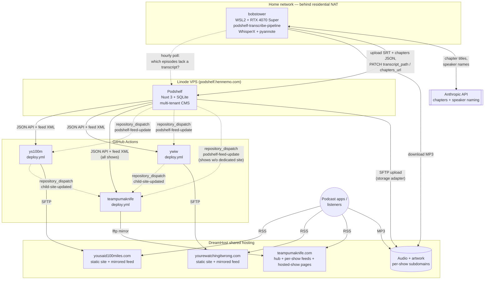

# Network architecture

This document describes how Podshelf fits into the network that publishes the Team
Puma Knife podcast family.

**This copy is the maintained one.** A copy also exists at
[`teampumaknife.com/docs/architecture.md`](../../teampumaknife.com/docs/architecture.md)
and used to be canonical, but it has drifted — as of 2026-09-08 it is three months
behind and missing the Networks and transcription sections. Update this file; sync
that one when convenient.

## At a glance

- **Podshelf (this repo)** is the source of truth — a self-hosted multi-tenant
  podcast CMS that owns episode metadata, RSS feeds, distribution config,
  transcripts, and chapters.
- **Three Nuxt 3 static sites** consume Podshelf's API + feed XML at build time and
  publish to DreamHost shared hosting:
  - `teampumaknife.com` — network hub, builds a page for every show.
  - `yousaid100miles.com` — dedicated site for the *You Said 100 Miles?* show.
  - `yourewatchingitwrong.com` — dedicated site for the *You're Watching It Wrong* show.
- **Audio files live on DreamHost**, not Podshelf. The static sites mirror the RSS
  feed so podcast apps fetch from DreamHost too. Podshelf itself stays cold to
  listener traffic — it only sees admin requests and per-deploy API hits.
- **Publishes propagate via GitHub `repository_dispatch` events.** Podshelf fires one
  on episode publish; dedicated child sites forward a second event to TPK after their
  own deploy so the hub picks up the new metadata.
- **Transcripts and chapters are produced off-network**, on a GPU box at home that
  polls Podshelf hourly for episodes missing them. It is the only component
  Podshelf cannot reach — it sits behind residential NAT — so it pulls rather than
  being pushed to.

## The repos

| Repo | Role | Stack | Hosting |
|---|---|---|---|
| [podshelf](../CLAUDE.md) | Source of truth: CMS, API, RSS feeds, storage adapters | Nuxt 3 full-stack + SQLite (`better-sqlite3`) | Linode VPS (1 GB Ubuntu) behind nginx + Cloudflare |
| [teampumaknife.com](../../teampumaknife.com/CLAUDE.md) | Network hub: a page per show, mirrored feeds, "from the vault" | Nuxt 3 static (SSG) + `@nuxt/content` + Tailwind v4 | DreamHost shared (`teampumaknife.com`) |
| [yousaid100miles.com](../../yousaid100miles.com/CLAUDE.md) | Dedicated site for *You Said 100 Miles?* (slug `ys100m`) | Nuxt 3 static + `@nuxt/content` + Tailwind v4 | DreamHost shared (`yousaid100miles.com`) |
| [yourewatchingitwrong.com](../../yourewatchingitwrong.com/CLAUDE.md) | Dedicated site for *You're Watching It Wrong* (slug `ywiw`) | Nuxt 3 static + `@nuxt/content` + Tailwind v4 | DreamHost shared (`yourewatchingitwrong.com`) |

Shows in the network that don't have their own dedicated site are served entirely
from TPK — their `/shows/<slug>/` and `/shows/<slug>/<episode>` pages on TPK *are*
the listener experience.

## This repo's role

**Podshelf is the source of truth and the only stateful service in the network.**
Everything else is a static-site build that re-derives its content from Podshelf's
API on every deploy.

What Podshelf owns:

- **The database.** SQLite (`server/db/schema.sql`) holds every podcast, episode,
  person, distribution destination, audit log entry, and slug alias. The static
  sites have no database of their own.
- **The RSS feed.** `server/routes/feeds/[slug].xml.ts` renders the canonical feed
  for each podcast at `GET /feeds/[slug].xml`. The static sites mirror this XML
  byte-for-byte and serve it from DreamHost under their own URLs — listener apps
  subscribe to the mirror, not to Podshelf.
- **The audio storage adapter.** `server/storage/sftp.ts` (and `s3.ts`) upload
  episode audio + artwork to wherever each podcast's storage is configured. For
  this network that's DreamHost SFTP under the relevant show's subdomain. Podshelf
  is *not* in the audio download path — it just writes the file once and emits the
  public URL.
- **The publish fan-out.** `server/utils/publish-event.ts → firePublishEvent()` is
  the single point where "an episode just became live" triggers
  `bumpFeedLastModified()`, `maybeAutoTrigger()` (the GitHub dispatch path), and
  `sendPublishWebhook()`.

What lives outside Podshelf: episode pages, listener-facing UI, transcript players,
network-level branding. None of those land in this repo.

The GitHub dispatch path is configured per-podcast under `/podcasts/<slug>/github`.
For shows with a dedicated site, dispatch the *site's* repo (which then forwards to
TPK after its deploy). For shows without a dedicated site, dispatch TPK directly
with event type `podshelf-feed-update`.

## Diagram

Solid arrows are continuous data flows (HTTP fetches, file uploads, listener
traffic). Dashed arrows are triggers rather than payloads — the
`repository_dispatch` hops, and the transcription box's hourly poll.

Note the shape of the transcription loop: the GPU box reads audio from DreamHost
(the public URL, same as any listener) and writes the results back through
Podshelf's API, which stores them via the same SFTP adapter that handles audio. It
never touches the static sites directly — a new transcript reaches listeners on the
next site build like any other content change.

## Data flow at build time

Each downstream Nuxt site runs a sync script before `nuxt generate` that pulls from
Podshelf's API + feed XML:

| What | Source on Podshelf | Where it lands on the consumer |
|---|---|---|
| Show metadata | `GET /api/podcasts/[slug]` | `content/shows/*.md` (TPK) or `assets/podcast.json` (sister sites) |
| Episodes | `GET /api/podcasts/[slug]/episodes` | `content/episodes/<slug>.md` |
| Distribution ("Listen on") | `GET /api/podcasts/[slug]/distribution` | Markdown frontmatter (TPK) / `assets/distribution.json` (sister sites) |
| RSS feed | `GET /feeds/[slug].xml` | `public/feed/<feedSlug>/index.xml` (TPK) or `public/feed.xml` (sister sites) |
| Transcripts | Per-episode `transcript_path` (SRT/VTT) | `public/transcripts/<slug>.json` |
| Chapters | Per-episode `chapters_url` (Podcasting 2.0 JSON) | Parsed into episode frontmatter |

Most reads use an API key (`X-Api-Key` header) scoped to the appropriate podcast
slug. TPK's key is unscoped or scoped to all shows; each sister site's key is
scoped to its own slug.

## The dispatch chain — how publishes propagate

`firePublishEvent()` in `server/utils/publish-event.ts` is the single fan-out point:

1. **Feed cache bump.** Forces revalidation on cached feed responses.
2. **GitHub dispatch.** Every go-live calls `firePublishDispatch()`, which posts to
   `https://api.github.com/repos/<owner>/<repo>/dispatches` **immediately** — the
   15-minute `PUBLISH_DEBOUNCE_MINUTES` window is not on this path. The debounce
   exists to coalesce a flurry of human edits into one build; a go-live is a single
   committed event. Pending dirty markers are cleared so the debounced path won't fire
   a redundant build minutes later. `client_payload` is
   `{ slug, reason, podcast_id, episode_id, fired_at }`, where `reason` is
   `podshelf:publish` or `podshelf:scheduled-publish`.
   - `episode-schedule` additionally bypasses the `github_auto_trigger` flag — the user
     committed to the publish when they hit Schedule.
   - `episode-create` / `episode-update` still respect `auto_trigger`; a podcast with it
     off is built by hand.
   - Ordinary edits to an *already-published* episode still take the debounced
     `maybeAutoTrigger()` path in `server/utils/github.ts`.
   The per-podcast `deploys_paused` kill switch on `/podcasts/<slug>/build` blocks
   **all** paths (auto, manual, test, and the scheduled go-live).
3. **Announcement, gated on the deploy** (`server/utils/announce.ts`). The
   `episode.publish` webhook links to `<website>/episodes/<slug>` — a page that does not
   exist until the build dispatched in step 2 has run and rsynced, several minutes later.
   Posting it inline (as Podshelf did until this was fixed) put a 404 link in the Discord
   channel. So `queuePublishAnnouncement()`:
   - Probes the episode URL once inline. Already live — or a podcast with no `website`,
     whose link is a Podshelf feed anchor needing no deploy — sends immediately and this
     costs one extra HEAD.
   - Otherwise parks a `pending_announcements` row. The scheduler re-probes each 60s tick
     and calls `deliverPublishWebhooks()` on the first 2xx. Probes follow redirects: a
     prerendered Nuxt route is written as `/episodes/<slug>/index.html` and Apache 301s
     the extensionless path to the trailing-slash form.
   - Releases anyway after `ANNOUNCE_MAX_WAIT_MINUTES` (30) with a
     `webhook.publish.deferred.timeout` audit entry. A late link beats an announcement
     silently swallowed by a broken build.
   Payload rows are re-read at delivery time, so a title fixed during the wait is the one
   that gets announced. Rows are deleted before delivery so an overlapping tick can't
   double-post, and cascade away if the episode is deleted or reverted to draft.

The configured repo is **whichever site owns the show's listener experience**:

- For shows with a dedicated site, dispatch the dedicated site's repo (event type
  `podshelf-feed-update`). The site rebuilds, then its `deploy.yml` fires a second
  `child-site-updated` dispatch to TPK so the hub re-pulls and re-renders.
- For shows without a dedicated site, dispatch TPK directly. The hub is the
  listener experience, so no second hop is needed.

Both downstream workflows are idempotent — a duplicate fire just rebuilds and
re-uploads what was already there. The selective-sync enhancement (see TPK
`docs/enhancements.md`) plans to use `client_payload.slug` to only sync the
affected show, cutting ~87% of build-time API calls.

## Hosting layout

| Property | Box | Why |
|---|---|---|
| Podshelf (this repo) | Linode VPS (1 GB Ubuntu, nginx + Cloudflare) | Keeps the CMS off shared hosting so we can run Node + SQLite. Listener traffic never lands here, so the small box is enough. |
| Static sites | DreamHost shared, one subscription, three subdomains | DreamHost shared is PHP-only at runtime, but for static SSG output that doesn't matter — it just serves files. "Unlimited" bandwidth on shared makes it the right home for podcast traffic. |
| Audio + artwork | DreamHost shared, under each show's subdomain | Listener MP3 fetches dominate bandwidth. Keeping them on DreamHost (not Podshelf) is how the Linode stays small. Podshelf's per-podcast SFTP storage adapter writes here using credentials configured under `/podcasts/<slug>/storage`. |

Audio URLs look like `https://<show>.teampumaknife.com/podcastepisodes/<file>.mp3`.
The Linode's ingress / egress allowance would be exhausted quickly if listener
traffic passed through it; the storage-adapter split is what keeps the monthly
hosting cost predictable.

## Transcription and chapters

Transcripts and Podcasting 2.0 chapters are produced by
[`podshelf-transcribe-pipeline`](https://github.com/bhenne22/podshelf-transcribe-pipeline),
which runs on a home Windows box (`bobstower`) inside WSL2 Ubuntu on an RTX 4070
Super. It is the only part of the network that isn't hosted infrastructure, and the
only one Podshelf cannot initiate contact with.

**Why it polls.** The box sits behind residential NAT, so a webhook has nowhere to
land. A Windows Task Scheduler job runs `backfill.sh` hourly; the script asks
Podshelf which published episodes are missing a `transcript_path` and fills the
gaps. Polling also self-heals in a way a webhook wouldn't — it catches anything
missing whatever the cause, including episodes edited long after publish. An idle
run is four API calls.

**The loop, per episode:**

1. `GET /api/podcasts/<slug>/episodes` — find episodes with no `transcript_path`.
2. Download the MP3 from its public DreamHost URL (the same URL listeners use).
3. WhisperX: transcribe (faster-whisper on CUDA), align, and diarize with pyannote.
4. Name the speakers from the episode's Podshelf **people attachments**, via a
   Claude call that maps `[SPEAKER_00]` to real names.
5. Generate chapters from the transcript with a second Claude call.
6. Upload the SRT and chapters JSON through `POST /api/podcasts/<slug>/upload`,
   then `PATCH` the episode with `transcript_path` and `chapters_url`.

Podshelf's storage adapter writes both files to DreamHost alongside the audio, so
the transcript is served from the same place as everything else. The static sites
pick it up on their next build; nothing else in the chain changes.

**Design rules worth preserving:**

- **It is a backfill, not a rewrite.** The PATCH body is built only from fields the
  server lacks, so an existing transcript or chapters URL is never overwritten and
  `description` is never touched. `--overwrite` exists for deliberate repairs and is
  not used by the scheduled run.
- **Podshelf's people roster drives speaker naming.** Attach people to an episode
  and naming follows; there is nothing per-show configured on the box. A roster
  shorter than the number of real voices is the usual cause of bad naming.
- **Output is validated before it is published.** A diarization that collapsed into
  a few long monologues, a chapter list that isn't ascending, or timestamps past
  the end of the episode all block the publish rather than shipping. Uncertain
  speaker names are left as `[SPEAKER_xx]` — anonymous beats wrong.

See `backfill.md` in that repo for the operational runbook, including why the job
has to be launched through Task Scheduler (WSL2 tears the VM down when the last
client disconnects, which kills a detached `screen`).

## Networks (in-Podshelf grouping)

A **network** is a named grouping of podcasts (e.g., "Team Puma Knife")
introduced so hosts on a multi-tenant Podshelf instance can see scheduling
intent across sibling shows without gaining edit access to them. The data
model is intentionally minimal:

- `networks` — `id, slug, title, description`.
- `network_podcasts` — `(network_id, podcast_id, position)`. A podcast can
  belong to multiple networks.

**Visibility is implicit.** There is no `network_users` join. If you're in
`podcast_users` for any podcast in network N, you can read N. Soft-deleted
podcasts are filtered out of network surfaces but the `network_podcasts`
row stays so restore re-attaches them automatically. API keys scoped to a
subset of podcasts only see the intersection of their scope with the
network — networks can never widen a key's data view. Mutations are
admin-only (`requireAdmin` blocks scoped API keys).

In the UI, networks surface as a `/networks/<slug>` dashboard (read-only
timeline of upcoming episodes across the roster) and an inline conflict
hint on the episode scheduling form (`NetworkConflictHint`) that warns
when a sibling has scheduled within ±3 days of the chosen slot.

There is **no unauthenticated public API**. Downstream static-site builds
(e.g. `teampumaknife.com`) authenticate with a per-instance API key the same
way the per-show sync scripts do.

**Custom properties.** A network can declare a small schema of extra fields
(e.g. `accentColor`, `hosted`, `externalUrl`, `vault`) with typed values
stored per `(network, podcast)`. The schema is fully user-defined per
network — nothing about it is TPK-specific. Definitions live in
`network_property_definitions`; values in `network_podcast_properties`
which FKs against the `network_podcasts` compound PK so leaving a network
auto-clears that podcast's values. Scoped API keys only see values for
podcasts inside their scope. This is the mechanism that lets TPK derive
its roster + per-show metadata from Podshelf and (eventually) delete its
`data/site-config.mjs`.

## Contracts that must not break

- **Feed URLs.** Podshelf renders the feed at `/feeds/<slug>.xml`, but listeners
  subscribe to the mirror on the static sites. If a podcast's slug ever has to
  change, write a `slug_aliases` row so the old feed URL keeps resolving and the
  feed handler emits `<itunes:new-feed-url>` per spec.
- **Audio enclosure URLs.** These are permanent contracts with podcast apps. The
  feed parser on the static sites must use the `<enclosure url>` value, not the
  API's `ep.audio_url` (which is a Blubrry tracking redirect — fine for analytics,
  but some browsers stall on the 302 in `<audio>` elements).
- **The publish fan-out shape.** `firePublishEvent()` is the single point where new
  episodes side-effect into the world. New side effects belong there, not scattered
  across endpoints. Same for new `client_payload` keys — add them consistently.
- **Storage adapter contracts.** `audio` and `artwork` directories per podcast are
  distinct on purpose (different `publicUrlBase`); helpers in
  `server/utils/storage-config.ts` route by `kind`. Don't collapse them.

## Where to look next

- This repo's `CLAUDE.md` — Podshelf internals: schema, API surface, storage
  adapters.
- `docs/api.md` — full API reference (also served at `/docs` on a running instance).
- `docs/deployment.md` — Linode provisioning runbook.
- `docs/storage.md` — SFTP / S3 storage adapter setup per podcast.
- `~/Code/teampumaknife.com/CLAUDE.md` — hub-specific design, SSG gotchas, deploy
  workflow.
- `~/Code/yousaid100miles.com/CLAUDE.md`, `~/Code/yourewatchingitwrong.com/CLAUDE.md`
  — per-show site internals.
- `~/Code/podshelf-transcribe-pipeline/backfill.md` — transcription runbook: the
  backfill commands, the diarization failure modes, and the speaker-naming flags.
